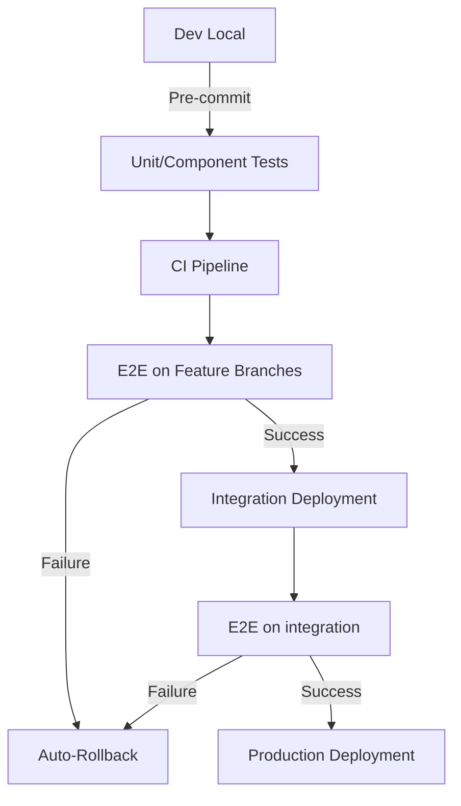

## Proposal: QA Strategy for Ninox Sign-up Flow

### 1. Introduction

The goal is to ensure the Ninox sign-up flow is robust, reliable, and provides a seamless user experience. This document outlines a QA strategy that includes multiple testing levels, automation, continuous integration, and monitoring.

### 2. Testing Levels and Why

We need a testing pyramid approach:

- **Unit Tests**: For individual functions and components. They are fast, cheap, and catch issues early. We expect developers to write these as part of their development process. QA teammates can support on extending and verifying the code coverage.
- **Integration Tests**: Test interactions between modules (e.g., API endpoints, services). They ensure that combined parts of the system work together.
- **End-to-End (E2E) Tests**: Simulate user flows (like the sign-up process) in a production-like environment. They catch issues that unit and integration tests might miss, such as browser-specific problems, network latency, and third-party integrations.
- **Visual Regression Tests**: To catch unintended UI changes. These can be part of E2E tests.
- **Performance Tests**: To ensure the sign-up flow is responsive under load.
- **Security Tests**: Especially for the sign-up flow which handles sensitive data.

#### 2.1 Testing Pyramid

| Level             | Coverage                        | Why                                                 | Tools           |
| ----------------- | ------------------------------- | --------------------------------------------------- | --------------- |
| Unit Tests        | 90%+ sign-up logic              | Catch bugs at the source; enable refactoring        | Jest            |
| Integration Tests | API contracts, service handoffs | Validate microservices interactions                 | Postman         |
| E2E Tests         | Critical user journeys          | Verify real-user experience across browsers/devices | Playwright      |
| Visual Regression | UI consistency                  | Prevent layout/cross-browser issues                 | Playwright      |
| Performance Tests | Sign-up under load              | Ensure SLA compliance (≤2s TTI)                     | k6, Lighthouse  |
| Security Scans    | OWASP Top 10 vulnerabilities    | Block credential leaks/attacks                      | OWASP ZAP, Burp |

### 3. When and Where Tests Run

- **Unit and Integration Tests**: Run on every commit in the CI pipeline. They must pass before merging.
- **E2E Tests**:
  - Run on every Merge Request (aka MR) against a feature branch environment to prevent breaking changes.
  - Run on integration environment before merging to Production.
- **Performance Tests**: Run periodically (e.g., weekly) and before major releases.
- **Security Tests**: Run as part of the CI pipeline and on a scheduled basis.

### 4. E2E Test Architecture

- **Framework**: We choose **Playwright** because it provides cross-browser testing, and has built-in features for flakiness reduction (e.g., retries, automatic waiting). It also supports visual testing.
- **Page Object Model (POM)**: To abstract page details and make tests maintainable.
- **Test Data Management**: Use factory functions to generate test data. Avoid hard-coded data.
- **Environment Management**: Tests should be configurable to run against different environments (feature bracnh, integration, production) via environment variables.
- **Parallel Execution**: Run tests in parallel across multiple browsers and machines to speed up feedback.

#### 4.1 Test Execution Framework




### 5. Managing Flaky Tests

- **Retry Mechanism**: Playwright supports built-in test retries at both the test and suite level, reducing false negatives caused by temporary issues (e.g., network latency).
- **Flaky Test Detection**: Use Playwright Dashboard to track flaky tests. Identify and quarantine flaky tests automatically.
- **Root Cause Analysis**: Playwright provides superior debugging tools to diagnose flakiness:
  - Trace Viewer – Records full execution context (network, DOM snapshots, console logs).
  - Auto-Captured Artifacts – Screenshots, videos, and HAR files on failure.
- **Stability Practices**:
  - Use stable selectors (e.g., `data-test-id` or 'id' attributes) instead of CSS that might change.
  - Avoid waiting for fixed times; use Playwright commands that wait for elements.
  - Isolate tests by cleaning state before each test (via API calls or database reset).

### 6. KPIs to Measure

- **Test Coverage**: Track code coverage (unit, integration) and E2E scenario coverage (percentage of user flows covered).
- **Test Stability**:
  - Flaky Test Rate: (Number of flaky tests / Total tests) \* 100. Aim for < 5%.
  - Test Failure Rate: (Number of failed test runs / Total test runs) \* 100.
- **Feedback Time**:
  - Time from commit to test results (should be under 10 minutes for unit/integration, under 30 minutes for E2E).
- **Defect Metrics**:
  - Number of production bugs related to sign-up flow (should decrease over time).
  - Mean Time To Detection (MTTD) and Mean Time To Resolution (MTTR) for bugs.
- **Performance Metrics**:
  - Sign-up page load time, time to complete sign-up (under 3 seconds for key actions).

### 7. PoC Implementation

We will implement a PoC for the Ninox sign-up flow E2E tests using Playwright. The PoC will cover:

- Navigating to the sign-up page.
- Filling in the sign-up form.
- Submitting the form and verifying workspace access.
  We'll use the staging environment: `https://q-www.ninox.com/`

### 8. PoC usage

To install packages for the tests by running:

```sh
yarn install
```

## Set the environment variables

Create a .env file in the project folder containing the following:

```
TESTING_URL='https://q-www.ninox.com/'
```

## Running unit test

To run tests for this project use:

```sh
yarn test
```

## Github Actions

Tests can be also run in [Github Actions](https://github.com/gg-hsi/Ninox-QA-Challenge/actions)

[](https://github.com/gg-hsi/Ninox-QA-Challenge/actions/workflows/playwright.yml)

### 9. References

- [Node.js](https://nodejs.org/en/)
- [Playwright](https://playwright.dev/)
